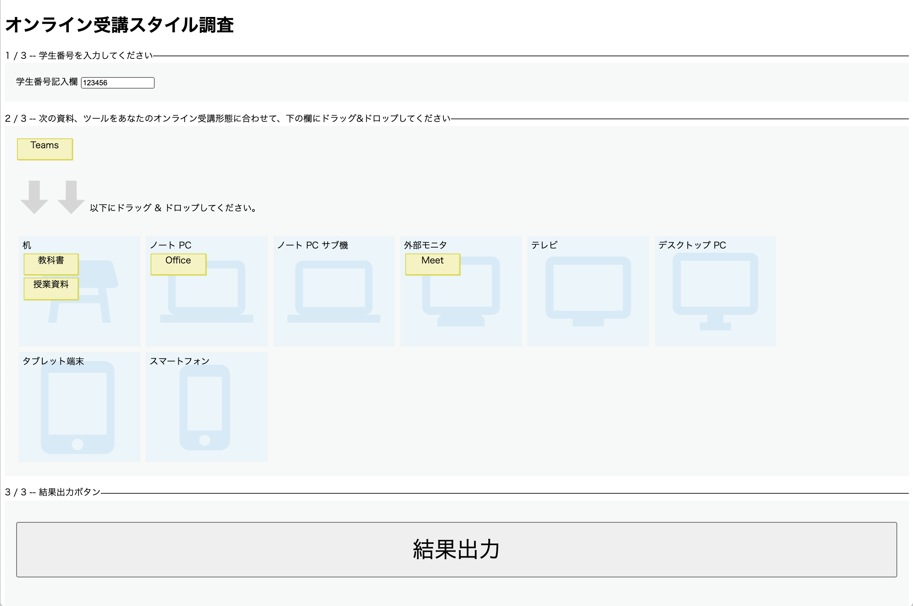

# webapp
ウェブアプリバージョン。出力は JSON。

## スクリーンショット


## JSON 出力の例

```json
{"item_textbook":"desk","item_teams":"sub_monitor","item_handout":"sub_monitor","item_meet":"sub_monitor","item_office":"notepc","student_id":"999"}
```

## 動作デモ

https://online-jukou-style.github.io/webapp/%E3%82%AA%E3%83%B3%E3%83%A9%E3%82%A4%E3%83%B3%E5%8F%97%E8%AC%9B%E3%82%B9%E3%82%BF%E3%82%A4%E3%83%AB%E8%AA%BF%E6%9F%BB.html
